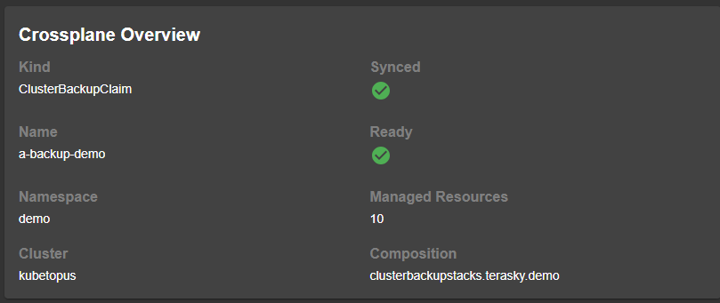

# Crossplane Plugins

The Crossplane plugins for Backstage provide a comprehensive solution for managing and visualizing Crossplane resources within your Backstage instance. These plugins enable teams to effectively monitor and control their cloud resources provisioned through Crossplane, with support for both Crossplane v1.x and v2.x APIs.

## Plugin Suite Components

The Crossplane plugin suite consists of several components:

- **Frontend Plugin (`@terasky/backstage-plugin-crossplane-resources`)**: 
  - Visualization and management of Crossplane resources
  - Support for both v1.x and v2.x APIs
  - Resource graphs and relationship mapping
  - YAML and event viewers
  - Overview cards and status monitoring

- **Backend Plugin (`@terasky/backstage-plugin-crossplane-resources-backend`)**:
  - Kubernetes API integration
  - Resource data retrieval and processing
  - Event monitoring and tracking
  - Permission management and access control
  - MCP actions for programmatic access

- **Common Library (`@terasky/backstage-plugin-crossplane-common`)**:
  - Shared types and interfaces
  - Permission definitions
  - Common utilities
  - Resource type definitions

## Key Features

### Resource Management
- **Comprehensive Resource Support**:
  - Claims and Composite Resources (XRs)
  - Managed Resources (MRs)
  - XRDs and Compositions
  - Functions and Packages
  - Support for both v1.x and v2.x APIs

### Visualization
- **Resource Graph**:
  - Interactive relationship visualization
  - Dependency tracking
  - Resource hierarchy display
  - Support for both API versions

### Monitoring
- **Event Tracking**:
  - Real-time event monitoring
  - Resource status updates
  - Condition tracking
  - Error and warning detection

### Configuration
- **YAML Management**:
  - View and inspect configurations
  - Copy to clipboard functionality
  - Download YAML files
  - Syntax highlighting

### Access Control
- **Permission Management**:
  - Fine-grained access control
  - Role-based permissions
  - Resource-specific controls
  - Action-based restrictions

### Integration
- **MCP Actions**:
  - Programmatic resource access
  - Event retrieval
  - Graph generation
  - Status monitoring

## Screenshots

### Resource Graph View


### Resource Table View


### Overview Information


## Available Permissions

The plugin suite provides granular permission controls for:

- Crossplane Claims (list, view YAML, show events)
- Composite Resources (list, view YAML, show events)
- Managed Resources (list, view YAML, show events)
- Additional Resources like XRD, Composition, Function (list, view YAML, show events)
- Resource Graph visualization

## MCP Actions Integration

The Crossplane plugin provides MCP (Model Control Protocol) actions for interacting with Crossplane resources. To enable these actions:

1. First, ensure you have the MCP actions backend plugin installed and configured. See the [MCP Actions Backend Plugin documentation](https://github.com/backstage/backstage/blob/master/plugins/mcp-actions-backend/README.md) for setup instructions.

2. Add the plugin to your actions configuration in `app-config.yaml`:

```yaml
backend:
  actions:
    pluginSources:
      - 'catalog'
      - 'crossplane'
      # ... other action sources
```

### Available MCP Actions

The plugin provides the following MCP actions:

- `get_crossplane_resources`: Get Crossplane resources and their dependencies
  - Input: Cluster name, resource details (group, version, plural, etc.)
  - Output: List of resources with their relationships and status

- `get_crossplane_events`: Get events for a specific Crossplane resource
  - Input: Cluster name, resource details (name, namespace, kind)
  - Output: List of events with timestamps and details

- `get_crossplane_resource_graph`: Get resource graph (v1.x API)
  - Input: Cluster name, XRD and claim details
  - Output: Resource graph data showing relationships

- `get_crossplane_v2_resource_graph`: Get resource graph (v2.x API)
  - Input: Cluster name, resource details
  - Output: Resource graph data for v2 resources

## Getting Started

To get started with the Crossplane plugins, you'll need to:

1. Install and configure the [Kubernetes Ingestor plugin](../kubernetes-ingestor/overview.md)
2. Install and configure the backend plugin
3. Install the frontend components
4. Configure MCP actions in your app-config.yaml
5. Configure permissions (optional but recommended)
6. Configure the plugins according to your needs

For detailed installation and configuration instructions, refer to the individual plugin documentation:

- [Kubernetes Ingestor Plugin Installation](../kubernetes-ingestor/backend/install.md)
- [Kubernetes Ingestor Plugin Configuration](../kubernetes-ingestor/backend/configure.md)
- [Frontend Plugin Installation](./frontend/install.md)
- [Frontend Plugin Configuration](./frontend/configure.md)
- [Backend Plugin Installation](./backend/install.md)
- [Backend Plugin Configuration](./backend/configure.md)
